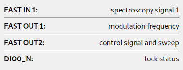

LINIEN
======

Spectroscopy locking of lasers using RedPitaya (STEMlab 125-14) that just works.
Linien aims to follow the UNIX philosophy of doing one thing very well.
It is built with Python and `Migen <https://github.com/m-labs/migen>`_ and is based on `RED PID <https://github.com/quartiq/redpid>`_.

Features
########

* **All included**: Modulation (up to 50 MHz), demodulation, filtering and servo implemented on the FPGA.
* **Client-server architecture**: Autonomous operation on RedPitaya. One or multiple GUI clients can connect to the server.
* **Autolock**: Click and drag over a line, and linien will automatically approach it and lock to it.
* **Lock detection**: linien is capable of detecting loss of lock.
* **Automatic relocking**: in that case, it can relock automatically using the autolock.
* **Remote-controllable**: The client libraries can be used to control or monitor the spectroscopy lock with python.
* **Combined FMS+MTS**: Supports dual-channel spectroscopy that can be used to implement `combined FMS+MTS <https://arxiv.org/pdf/1701.01918.pdf>`_
* **Logging**: Use `linien-influxdb <https://github.com/hermitdemschoenenleben/linien-influxdb>`_ to log the lock status to influxdb.
* **TTL status**: Outputs the lock status via TTL

Getting started
###############
.. _standalone binaries: `standalone-binary`_

.. _install it using pip: `pip-install`_

Linien runs on Windows and Linux. For most users the `standalone binaries`_ containing the graphical user interface are recommended. If you want to control linien using the python interface you should `install it using pip`_.

.. _standalone-binary:

Standalone binary
-----------------

You can download standalone binaries for windows and linux on `the releases page <https://github.com/hermitdemschoenenleben/linien/releases>`_.
On linux you have to mark it as executable before executing:

..  code-block:: bash

    chmod +x linien-client-linux*

.. _pip-install:

Installation with pip
---------------------

Linien is written for python 3 and can be installed using python's package manager pip:

..  code-block:: bash

    pip3 install linien

Run the application by calling

..  code-block:: bash

    linien

If this doesn't work, your local bin directory (e.g. ~/.local/bin) is probably missing in your PATH.
Alternatively you can open linien using python:

..  code-block:: python

    from linien.client.client import run_application
    run_application()

Then, you can enter your RedPitaya's credentials and connect. If you agree, linien's server component is automatically installed.

Physical setup
##############

Linien aims to be self-explanatory. The first tab of the right panel displays the physical setup, depending on the settings. `See here <https://redpitaya.readthedocs.io/en/latest/_images/Extension_connector.png>`_ for an overview of RP's pins.

Scriptable interface
####################

In addition to the GUI, Linien can also be controlled using python scripts.
For that purpose, installation via pip is required (see above).

..  code-block:: python

    from linien.client.connection import BaseClient, MHz, Vpp
    c = BaseClient(host, 18862, False)

    # read out the modulation frequency
    print(c.parameters.modulation_frequency.value / MHz)

    # set modulation amplitude
    c.parameters.modulation_amplitude.value = 1 * Vpp
    # in the line above, we set a parameter. This is not written directly to the
    # FPGA, though. In order to do this, we have to call write_data():
    c.connection.root.write_data()

    # plot control and error signal
    import pickle
    from matplotlib import pyplot as plt
    plot_data = pickle.loads(c.parameters.to_plot.value)

    # depending on the status (locked / unlocked), different signals are available
    print(plot_data.keys())

    # if unlocked, signal1 and signal2 contain the error signal of channel 1 and 2
    # if the laser is locked, they contain error signal and control signal.
    if c.parameters.locked.value:
        plt.plot(plot_data['control_signal'], label='control')
        plt.plot(plot_data['error_signal'], label='error')
    else:
        plt.plot(plot_data['error_signal_1'], label='error 1')
        plt.plot(plot_data['error_signal_2'], label='error 2')

    plt.legend()
    plt.show()

For a full list of parameters that can be controlled or accessed have a look at `parameters.py <https://github.com/hermitdemschoenenleben/linien/blob/master/linien/server/parameters.py>`_.

Development
###########

As linien uses a git submodule, you should check it out like this:

..  code-block:: bash

    git clone https://github.com/hermitdemschoenenleben/linien.git --recursive

Then edit the `VERSION` file and replace it's content with

..  code-block::

    dev

When starting a development version of the client, the latest server code is automatically uploaded to the RedPitaya which should simplify development of the server component.
For that, check that no server is running on the RedPitaya (execute `linien_stop_server` on the RedPitaya) before launching the client. Your development code is then uploaded to the /linien directory of the RedPitaya and the linien server is started from there.

Fake server
-----------

For testing the GUI, there is also a fake server that you can run locally on your machine:

..  code-block:: bash

    python3 server/server.py --fake

Then you can connect to "localhost" using the client.

Run server locally
------------------

For debugging it may also be helpful to execute the server component on your machine (e.g. if you want to work on the autolock). In order to provide access to the FPGA registers, you have to start `server/acquisition_process.py` on the RedPitaya. Then you can run the server locally and connect to the FPGA registers:

    python3 server/server.py --remote-rp=root:password@rp-f0xxxx.local

Building the FPGA image
-----------------------

In order to build the FPGA image, use `scripts/build_gateware.sh`.

Releasing a new version
-----------------------

First, update the version number in the `VERSION` file.
Then you can build and upload the package to pypi using `scripts/upload_pypi.sh`.
Finally, build the standalone client using `build_standalone_client.sh` (you have to do this on the platform you want to build the standalone client for). The standalone client should be uploaded to a github release.

See Also
########

* `RedPID <https://github.com/quartiq/redpid>`_: the basis of linien
