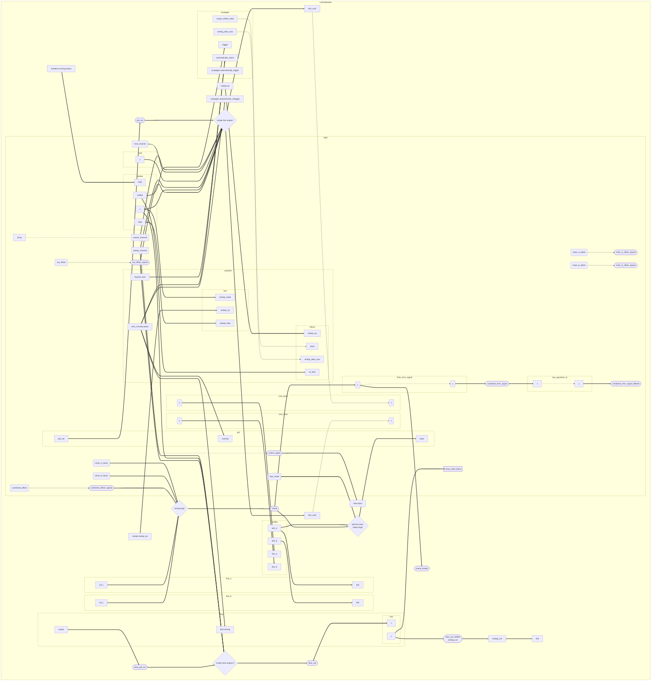

```mermaid
flowchart TB
subgraph LinienModule
    subgraph logic["logic <LinienLogic>"]
        direction TB
        %% dual_channel(dual_channel)
        chain_a_factor(chain_a_factor)
        chain_b_factor(chain_b_factor)
        chain_a_offset(chain_a_offset) ---> chain_a_offset_signed([chain_a_offset_signed])
        chain_b_offset(chain_b_offset) ---> chain_b_offset_signed([chain_b_offset_signed])
        combined_offset(combined_offset) ---> combined_offset_signed([combined_offset_signed])
        out_offset(out_offset) ---> out_offset_signed([out_offset_signed])
        mod_channel(mod_channel)
        sweep_channel(sweep_channel)
        fast_mode(fast_mode)
        slow_value.status>slow_value.status]
        %% slow_decimation(slow_decimation)
        %% analog_out_1(analog_out_1)
        %% analog_out_2(analog_out_2)
        %% analog_out_2(analog_out_3)
        subgraph mod
            mod.y[y]
        end

        subgraph sweep
            sweep.y[y]
            sweep.hold[hold]
            sweep.step[step]
            sweep.trigger[sweep]
        end
        subgraph limit_error_signal
            limit_error_signal.x(x) -...-> limit_error_signal.y(y)
        end
        limit_error_signal.y ===> combined_error_signal([combined_error_signal])
        subgraph limit_fast1
            limit_fast1.x(x)
            limit_fast1.y(y)
        end
        subgraph limit_fast2
            limit_fast2.x(x)
            limit_fast2.y(y)
        end
        Array -...- control_channel(control_channel) -...-> control_signal([control_signal])
        subgraph pid["pid"]
            pid.input[input]
            pid.pid_out[pid_out]
            pid.running[running]
        end
        subgraph autolock
            autolock.lock_running.status[lock_running.status]
            autolock.request_lock[request_lock]
            subgraph robust
                autolock.robust.input[input]
                autolock.robust.writing_data_now[writing_data_now]
                autolock.robust.at_start[at_start]
                autolock.robust.sweep_up[sweep_up]
            end
            subgraph fast
                autolock.fast.sweep_value[sweep_value]
                autolock.fast.sweep_up[sweep_up]
                autolock.fast.sweep_step[sweep_step]
            end
        end
        subgraph raw_aquisition_iir
            raw_aquisition_iir.x[x]
            raw_aquisition_iir.y[y]
            raw_aquisition_iir.x -...-> raw_aquisition_iir.y
        end
        raw_aquisition_iir.y ===> combined_error_signal_filtered([combined_error_signal_filtered])
        combined_error_signal ===> raw_aquisition_iir.x
    end

    subgraph analog["analog<PitayaAnalog>"]
        analog.adc_a[adc_a]
        analog.adc_b[adc_b]
        analog.dac_a[dac_a]
        analog.dac_b[dac_b]
    end
    
    subgraph fast_a["fast_a <FastChain>"]
        fast_a.adc[adc]
        fast_a.out_i[out_i]
    end
    subgraph fast_b["fast_b <FastChain>"]
        fast_b.adc[adc]
        fast_b.out_i[out_i]
    end

    analog.adc_a ===> fast_a.adc
    analog.adc_b ===> fast_b.adc

    %% mixing the signals
    mixing-logic{mixing-logic} ===> mixed([mixed])
    fast_a.out_i ===>  mixing-logic
    fast_b.out_i ===>  mixing-logic
    chain_a_factor ===> mixing-logic
    chain_b_factor ===> mixing-logic
    combined_offset_signed ===> mixing-logic
    mixed ===> limit_error_signal.x ===> mixed_limited([mixed_limited])

    %%connect_pid
    autolock.lock_running.status ===> pid.running
    autolock.running.status ===> sweep.hold
    sweep.y ===> autolock.fast.sweep_value
    sweep.sweep_up ===> autolock.fast.sweep_up
    sweep.step ===> autolock.fast.sweep_step
    sweep.up ===> autolock.robust.sweep_up
    %% PID
    fast_mode ===> pid-fast-slow-select-logic
    analog.adc_a ===> pid-fast-slow-select-logic
    mixed ===> pid-fast-slow-select-logic
    pid-fast-slow-select-logic{"pid-fast-slow-\nselect-logic"} ===> pid.input
    pid.pid_out ===> pid_out([pid_out])

    %% combine signals for fast outputs
    create-fast-output-i{"create-fast-output-i"}
    control_channel ===> create-fast-output-i
    pid_out ===> create-fast-output-i
    mod_channel ===> create-fast-output-i
    mod.y ===> create-fast-output-i
    sweep_channel ===> create-fast-output-i
    sweep.y ===> create-fast-output-i
    out_offset_signed ===> create-fast-output-i
    create-fast-output-i ===> fast_out1
    create-fast-output-i ===> fast_out2
    subgraph slow
        slow.pid.running[pid.running]
        slow.output[output]
        subgraph limit
            slow.limit.x[x]
            slow.limit.y[y]
        end
    end

    autolock.lock_running.status ===> slow.pid.running
    slow.output ===> slow_pid_out([slow_pid_out])
    slow_pid_out ===> 
    create-slow-output-0{"create-slow-output-0"} ===> slow_out([slow_out])
    sweep_channel ===> create-slow-output-0
    sweep.y ===> create-slow-output-0
    out_offset_signed ===> create-slow-output-0
    slow_out ===> slow.limit.x
    slow.limit.y ===> slow_out_shifted(["slow_out_shifted\nanalog_out"])
    slow_out_shifted ===> analog_out
    analog_out ===> ds0

    subgraph scopegen
        scopegen.scope_written_data[scope_written_data]
        scopegen.writing_data_now[writing_data_now]
        scopegen.sweep_trigger[trigger]
        scopegen.automatically_rearm[automatically_rearm]
        scopegen.automatically_trigger
    end

    scopegen.scope_written_data ---> autolock.robust.input
    scopegen.writing_data_now ---> autolock.robust.writing_data_now

    sweep.trigger ===> scopegen.sweep_trigger
    sweep.trigger ===> autolock.robust.at_start
    autolock.request_lock ===> scopegen.automatically_rearm
    autolock.lock_running.status ===> scopegen.automatically_rearm
    autolock.lock_running.status ===> scopegen.automatically_retrigger

    %% fast out
    limit_fast1.y ===> analog.dac_a
    limit_fast2.y ===> analog.dac_b

    %% slow out
    control_signal ===> slow.input
    slow.limit.y ===> slow_value.status

    fast_out1 ---> limit_fast1.x
    fast_out2 ---> limit_fast2.x
end
```